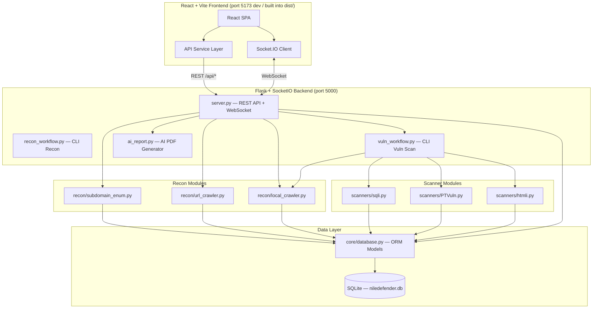
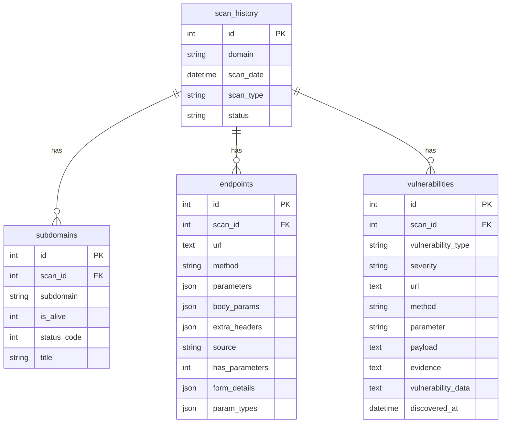
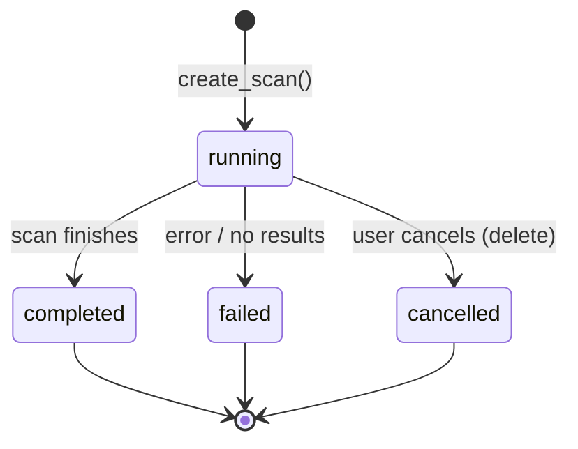
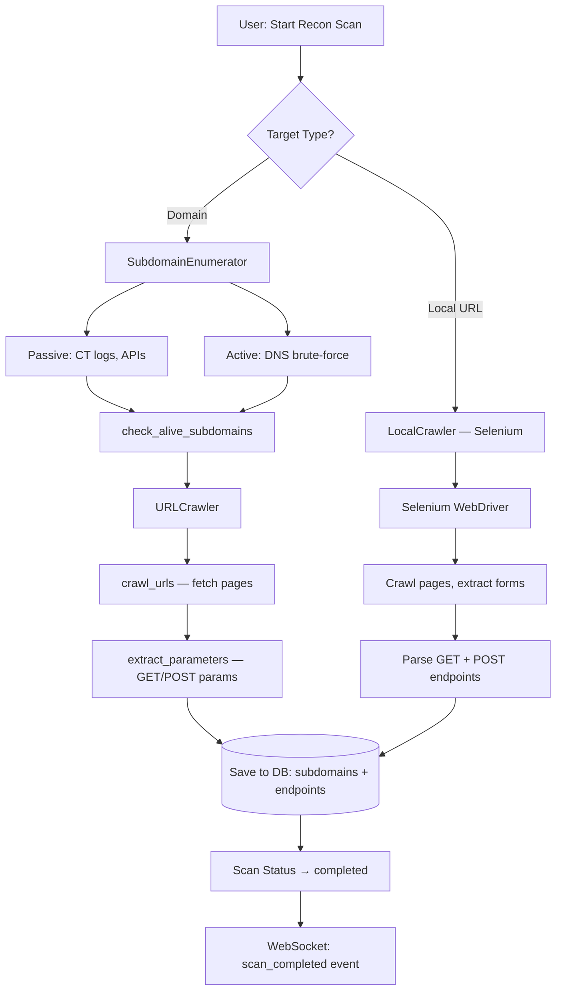
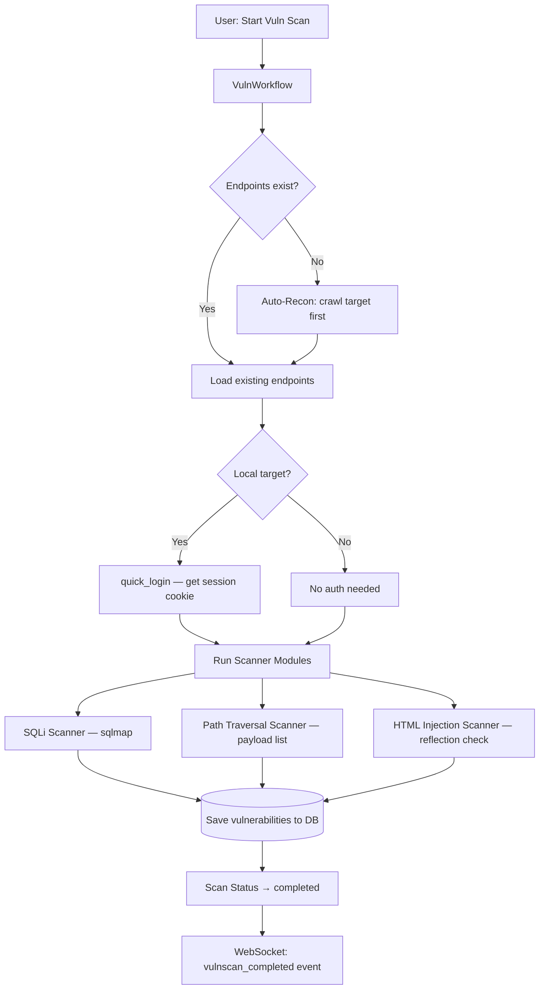
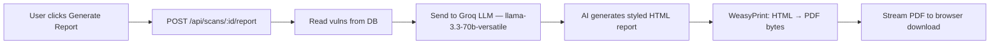

# NileDefender — Project Knowledge Base

> **Purpose:** This file gives any developer or AI assistant a complete understanding of
> the NileDefender project — its idea, architecture, file structure, data flow, and
> current state — in one place.

---

## 🎯 Project Idea

**NileDefender** is a **web vulnerability scanner** built for security researchers and
penetration testers. It automates the full pipeline from **reconnaissance** (discovering
subdomains & endpoints) to **vulnerability scanning** (SQLi, Path Traversal, HTML
Injection) and **AI-powered report generation** (PDF reports via Groq LLM).

### Key Features

| Feature | Description |
|---|---|
| **Subdomain Enumeration** | Passive (CT logs, APIs) + Active (DNS brute-force) |
| **URL Crawling** | Discover endpoints and extract GET/POST parameters |
| **Local App Crawling** | Selenium-based crawler for localhost apps (e.g. bWAPP, DVWA) |
| **SQL Injection Scanner** | Uses sqlmap under the hood |
| **Path Traversal Scanner** | Custom payload-based LFI/directory traversal detection |
| **HTML Injection Scanner** | Payload reflection analysis |
| **Real-time Updates** | WebSocket (Socket.IO) for live scan progress |
| **AI Report Generation** | Groq LLM generates professional PDF security assessment |
| **Data Export** | JSON/CSV export of all scan data |
| **React Dashboard** | Modern React + Vite SPA with dark navy + teal theme |

---

## 🏗️ Architecture Overview



### Architecture Pattern

```
Production:  Flask serves React build from frontend/dist/
Development: Vite dev server (port 5173) proxies /api/* and /socket.io/* to Flask (port 5000)
```

---

## 📁 File Structure

```
NileDefender/
├── server.py                  # 🔹 Main entry point — Flask API + WebSocket + serves React
├── recon_workflow.py          # 🔹 CLI for standalone reconnaissance
├── vuln_workflow.py           # 🔹 CLI for standalone vulnerability scanning
├── ai_report.py               # 🔹 AI report generator (Groq LLM → HTML → PDF via WeasyPrint)
├── config.ini                 # 🔑 API keys (Groq, SecurityTrails, etc.)
├── requirements.txt           # 📦 Python dependencies (Python 3.13)
│
├── core/                      # 📂 Core infrastructure
│   ├── __init__.py
│   └── database.py            # 🔹 SQLAlchemy ORM models + CRUD functions
│
├── recon/                     # 📂 Reconnaissance modules
│   ├── __init__.py
│   ├── subdomain_enum.py      # 🔹 Subdomain discovery (passive + active)
│   ├── url_crawler.py         # 🔹 URL crawling + parameter extraction
│   └── local_crawler.py       # 🔹 Selenium-based local app crawler + auto-login
│
├── scanners/                  # 📂 Vulnerability scanner modules
│   ├── __init__.py            # 🔹 Scanner registry (SCANNER_MODULES dict)
│   ├── base.py                # 🔹 Base scanner class
│   ├── sqli.py                # 🔹 SQL Injection scanner (wraps sqlmap)
│   ├── PTVuln.py              # 🔹 Path Traversal / LFI scanner
│   ├── htmli.py               # 🔹 HTML Injection scanner
│   └── payloads/
│       └── directory_traversal.txt  # Payload wordlist
│
├── frontend/                  # 📂 React + Vite SPA
│   ├── package.json           # Dependencies: react, react-router-dom, socket.io-client
│   ├── vite.config.js         # Dev proxy → Flask :5000
│   ├── index.html             # Entry HTML with SEO meta tags
│   ├── src/
│   │   ├── main.jsx           # React entry point
│   │   ├── App.jsx            # App shell — BrowserRouter + layout + routes
│   │   ├── index.css          # 🎨 Global design system (dark navy + teal theme)
│   │   ├── hooks/
│   │   │   └── useSocket.js   # Custom Socket.IO hook for real-time scan updates
│   │   ├── services/
│   │   │   └── api.js         # All REST API calls + export/download helpers
│   │   ├── components/
│   │   │   ├── Sidebar.jsx    # Navigation sidebar with connection status
│   │   │   ├── StatCard.jsx   # Dashboard/detail stat cards
│   │   │   ├── Badge.jsx      # Status, severity, and method badges
│   │   │   ├── NewScanModal.jsx  # Recon scan + Vuln scan creation modal
│   │   │   ├── DeleteModal.jsx   # Single/bulk delete confirmation modal
│   │   │   └── Notification.jsx  # Toast notification system (context-based)
│   │   └── pages/
│   │       ├── Dashboard.jsx     # Overview: stats + recent scans
│   │       ├── Scans.jsx         # Scan list (cards grid)
│   │       ├── ScanDetails.jsx   # Single scan: stats, tabs, export, AI report
│   │       ├── Subdomains.jsx    # Aggregated subdomains across all scans
│   │       ├── Endpoints.jsx     # Aggregated endpoints with method filters
│   │       └── Vulnerabilities.jsx  # Aggregated vulns with severity filters
│   └── dist/                  # Built production bundle (served by Flask)
│
├── output/                    # 📂 Runtime data
│   └── niledefender.db        # SQLite database (auto-created)
│
├── templates/                 # 📂 Fallback template (if React build doesn't exist)
├── Dockerfile                 # Docker containerization
├── docker-compose.yml         # Docker Compose config
└── my-env/                    # Python virtual environment (not committed)
```

---

## 💾 Database Schema



### Scan Status Lifecycle



---

## 🔄 Data Flow — Scan Pipeline

### Recon Scan Flow



### Vulnerability Scan Flow



### AI Report Flow



---

## 🌐 REST API Reference

| Method | Endpoint | Description |
|--------|----------|-------------|
| `GET` | `/api/dashboard/stats` | Aggregated stats across all scans |
| `GET` | `/api/scans` | List all scans |
| `POST` | `/api/scans` | Create new recon scan (auto-detects local vs remote) |
| `GET` | `/api/scans/:id` | Get full scan details (scan + subdomains + endpoints + vulns) |
| `DELETE` | `/api/scans/:id` | Delete scan + all related data |
| `DELETE` | `/api/scans/all` | Delete all scans |
| `GET` | `/api/scans/search?target=` | Search for existing scans by target |
| `GET` | `/api/scans/:id/stats` | Get scan statistics |
| `GET` | `/api/scans/:id/subdomains` | List subdomains for a scan |
| `GET` | `/api/scans/:id/endpoints` | List endpoints for a scan |
| `GET` | `/api/scans/:id/vulnerabilities` | List vulnerabilities for a scan |
| `POST` | `/api/scans/:id/vulnscan` | Start vuln scan on an existing scan |
| `POST` | `/api/vulnscan/start` | Start vuln scan on a new target |
| `POST` | `/api/scans/:id/report` | Generate AI PDF report → download |
| `GET` | `/api/all/subdomains` | Aggregated subdomains across all scans |
| `GET` | `/api/all/endpoints` | Aggregated endpoints across all scans |
| `GET` | `/api/all/vulnerabilities` | Aggregated vulnerabilities across all scans |

### WebSocket Events

| Event | Direction | Description |
|-------|-----------|-------------|
| `connect` | Server → Client | Connection established |
| `join_scan` | Client → Server | Join a scan room for real-time updates |
| `scan_update` | Server → Client | Progress update (phase, message) |
| `scan_completed` | Server → Client | Recon scan finished |
| `vulnscan_completed` | Server → Client | Vulnerability scan finished |
| `scan_error` | Server → Client | Scan failed with error |

---

## 🎨 Design System

### Color Palette (matched to banner.png)

| Role | Value | Preview |
|------|-------|---------|
| **Background (deep)** | `#060e1a` | 🟫 Near-black navy |
| **Background (cards)** | `rgba(12, 26, 46, 0.72)` | 🟫 Translucent navy |
| **Accent Primary** | `#6cc5c7` | 🟩 Teal/Cyan |
| **Accent Secondary** | `#4fa8ab` | 🟩 Darker teal |
| **Accent Bright** | `#8ee0e2` | 🟩 Light teal |
| **Text Primary** | `#eaf5f6` | ⬜ Cool white |
| **Text Secondary** | `#8db4bc` | 🔵 Muted teal |
| **Text Muted** | `#4a7580` | 🔵 Dark teal |
| **Borders** | `rgba(108, 197, 199, 0.1)` | 🔲 Subtle teal |

### Design Principles

- **Glassmorphism**: Translucent cards with backdrop-filter blur
- **Depth**: Multi-layer shadows + glow effects on hover
- **Micro-animations**: Hover lifts, glow pulses, smooth transitions
- **Typography**: Inter font, weights 400–900, tight letter-spacing for headings
- **Dark theme only**: Designed for low-light security operations

---

## 🧩 Scanner Module Registry

Scanners are registered in `scanners/__init__.py` via the `SCANNER_MODULES` dict.

```python
SCANNER_MODULES = {
    'sqli':  { 'name': 'SQL Injection',    'run': run_sqli_scan  },
    'pt':    { 'name': 'Path Traversal',   'run': run_pt_scan    },
    'htmli': { 'name': 'HTML Injection',   'run': run_htmli_scan },
}
```

### Adding a New Scanner

1. Create `scanners/new_scanner.py` with a function:
   ```python
   def run_new_scan(scan_id, db_path, on_progress=None, cookie=None) -> dict:
       # ... scan logic ...
       return {'targets_scanned': N, 'vulnerabilities_found': M}
   ```
2. Register in `scanners/__init__.py`:
   ```python
   from scanners.new_scanner import run_new_scan
   SCANNER_MODULES['new'] = {
       'name': 'New Scanner',
       'description': '...',
       'run': run_new_scan,
   }
   ```
3. Add checkbox in `frontend/src/components/NewScanModal.jsx` module grid

---

## 🖥️ Running the Project

### Development Mode (Hot Reload)

```bash
# Terminal 1: Flask backend
cd NileDefender
source my-env/bin/activate
python server.py                    # → http://localhost:5000

# Terminal 2: Vite dev server (with HMR)
cd NileDefender/frontend
npm run dev                         # → http://localhost:5173 (proxies to Flask)
```

### Production Mode

```bash
cd NileDefender/frontend
npm run build                       # Build React → frontend/dist/
cd ..
python server.py                    # Flask serves React from dist/ at :5000
```

### CLI Tools (No Web UI)

```bash
# Recon only
python recon_workflow.py -d example.com

# Vulnerability scan
python vuln_workflow.py --target http://localhost/bWAPP/ --modules sqli pt

# AI report
python ai_report.py --db output/niledefender.db --pdf report.pdf
```

---

## ⚙️ Key Dependencies

| Category | Package | Purpose |
|----------|---------|---------|
| **Web** | Flask, Flask-SocketIO, Flask-CORS | REST API + WebSocket |
| **Database** | SQLAlchemy | ORM + SQLite |
| **HTTP** | Requests, urllib3 | HTTP requests |
| **DNS** | dnspython | DNS resolution |
| **Parsing** | BeautifulSoup4, lxml | HTML parsing |
| **Browser** | Selenium, webdriver-manager | Local app crawling |
| **AI** | Groq | LLM API for report generation |
| **PDF** | WeasyPrint | HTML → PDF conversion |
| **Frontend** | React 19, React Router 7, Socket.IO Client | SPA + routing + WebSocket |
| **Build** | Vite 8 | Frontend build tool |

---

## 🔮 Future Expansion Ideas

- [ ] **XSS Scanner** — Cross-site scripting detection
- [ ] **CORS Misconfiguration** — CORS header analysis
- [ ] **Authentication Testing** — Brute-force / weak credentials
- [ ] **API Fuzzing** — REST API endpoint fuzzing
- [ ] **Scheduled Scans** — Cron-based recurring scans
- [ ] **Multi-user Auth** — Login system for the web UI
- [ ] **Scan Comparison** — Diff two scans to detect new vulns
- [ ] **Notification Webhooks** — Slack/Discord alerts on findings
